# OASR

**Open Agent Skill Registry** — Register, sync, and reuse AI agent skills across IDEs with a single source of truth.

---

> For a non-exhaustive list of highlighted features, see [FEATURES.md](docs/FEATURES.md).

## The Problem

You've built useful skills for your AI coding assistant. They work great in Cursor. Now you want them in Windsurf. And Claude. And Copilot.

Each tool expects skills in different locations with different formats:

- Cursor: `.cursor/commands/`
- Windsurf: `.windsurf/workflows/`
- Claude: `.claude/commands/`
- Copilot: `.github/prompts/`

So you copy your skills everywhere. Then you improve one. Now the copies are stale. You forget which version is current. Some break silently. This is **skill drift**.

## The Solution

ASR keeps your skills in a registry, syncs local and remote sources, and generates thin adapters for each IDE.
It also lets you execute skills safely with policy profiles.

Key capabilities:
- Register skills once (local folders or GitHub/GitLab URLs)
- Sync and track drift across sources
- Generate IDE adapters and run skills via `oasr exec`

```text
┌─────────────────────────────────────────────────────────┐
│           Your Skills (canonical source)                │
│           ~/skills/git-commit/SKILL.md                  │
│           ~/skills/code-review/SKILL.md                 │
└───────────────────────┬─────────────────────────────────┘
                        │
                        ▼
                   oasr adapter
                        │
        ┌───────────────┼──────────────┐...───────────────┐
        ▼               ▼              ▼                  ▼
   .cursor/        .windsurf/       .claude/           <vendor>/
   commands/       workflows/       commands/           skills/
```

No copying. No drift. One source of truth.

---

## Quick Example

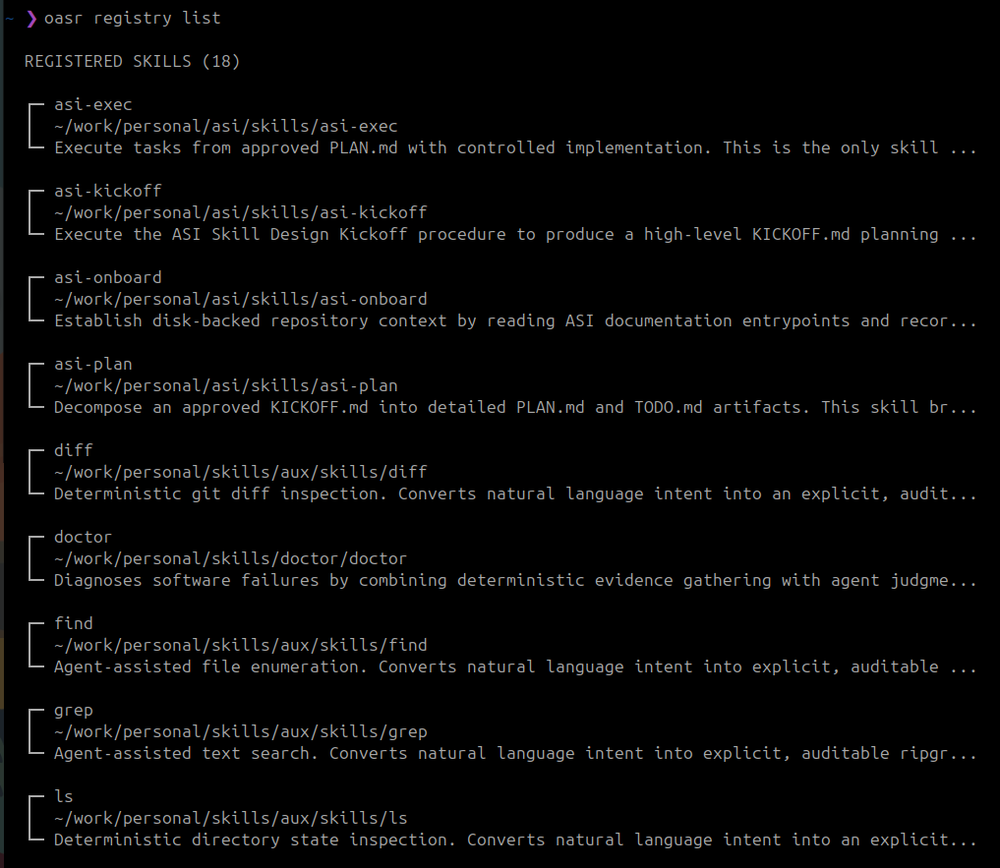
*List all registered skills with metadata*

```bash
# Register local skills
oasr registry add ~/skills/git-commit
oasr registry add ~/skills/code-review

# List registered skills
oasr registry list

# Register remote skills from GitHub/GitLab
oasr registry add https://github.com/user/skills-repo/tree/main/my-skill
oasr registry add https://gitlab.com/org/project/tree/main/cool-skill

# Generate adapters for a project
oasr adapter --output-dir ~/projects/my-app

# Result:
# ~/projects/my-app/.cursor/commands/git-commit.md
# ~/projects/my-app/.windsurf/workflows/git-commit.md
# ~/projects/my-app/.claude/commands/git-commit.md
```

---

## Remote Skills

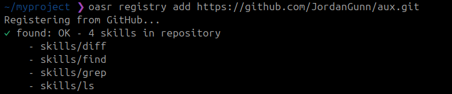
*Register skills directly from GitHub or GitLab*

ASR supports registering skills directly from GitHub and GitLab repositories:

```bash
# Add a skill from GitHub
oasr registry add https://github.com/user/repo/tree/main/skills/my-skill

# Add a skill from GitLab
oasr registry add https://gitlab.com/org/project/tree/dev/cool-skill

# Sync remote skills (check for updates)
oasr registry sync

# Use remote skills
oasr clone my-skill -d ./output
```

**Authentication** (optional, for private repos and higher rate limits):

```bash
export GITHUB_TOKEN=ghp_your_token_here
export GITLAB_TOKEN=glpat_your_token_here
```

Remote skills are fetched on-demand during `adapter` and `clone` operations. The registry stores the URL, and `oasr registry sync` checks if the remote source has changed.

---

## Shell Completions

OASR supports intelligent tab completion for Bash, Zsh, Fish, and PowerShell:

```bash
# Install for your current shell
oasr completion install

# Install for a specific shell (shortcut)
oasr completion zsh --install

# Now try it:
oasr <TAB>          # Complete commands
oasr info <TAB>     # Complete skill names
oasr exec --<TAB>   # Complete flags
```

Completions are **dynamic** — skill names, agents, and profiles are fetched live from your registry.

See [`oasr completion --help`](docs/commands/COMPLETION.md) for details.

---

## JSON Output

Use `--json` for legacy JSON output. Use `--json v2` for the structured envelope
with `version`, `success`, `command`, and `error` fields.

---

## Accessibility

- Disable ANSI colors: `NO_COLOR=1 oasr ...` or `OASR_NO_COLOR=1 oasr ...`
- Use ASCII symbols: `OASR_NO_UNICODE=1 oasr ...`

---

## Documentation

- **[Quickstart](docs/QUICKSTART.md)** — Installation and first steps
- **[Commands](docs/commands/.INDEX.md)** — Full command reference
- **[Validation](docs/validation/.INDEX.md)** — Validation rules and error codes

---

## Supported `oasr adapter` IDEs

| IDE            | Adapter    | Output                        |
|----------------|------------|-------------------------------|
| Cursor         | `cursor`   | `.cursor/commands/*.md`       |
| Windsurf       | `windsurf` | `.windsurf/workflows/*.md`    |
| Codex          | `codex`    | `.codex/skills/*.md`          |
| GitHub Copilot | `copilot`  | `.github/prompts/*.prompt.md` |
| Claude Code    | `claude`   | `.claude/commands/*.md`       |

---

## License

See [LICENSE](LICENSE).

## Screenshots

### Command Examples

| Command | Screenshot |
|---------|-----------|
| **oasr registry list** |  |
| **oasr registry add** (local) | 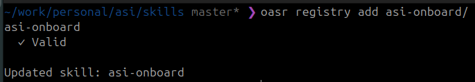 |
| **oasr registry add** (remote) |  |
| **oasr registry sync** | 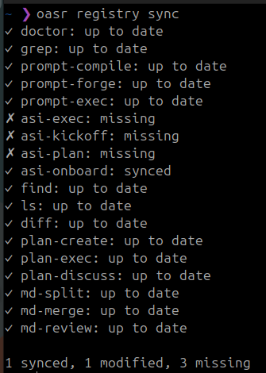 |
| **oasr registry prune** | 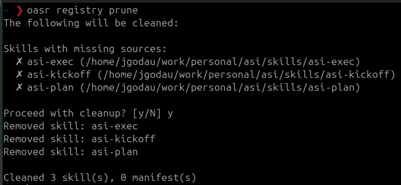 |
| **oasr registry** (validate) | 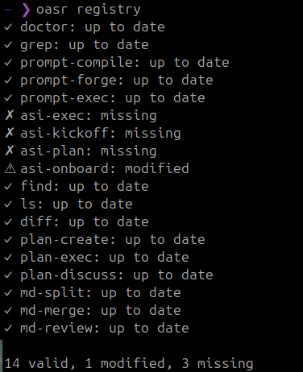 |
| **oasr find** | 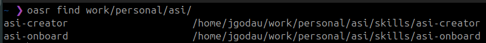 |
| **oasr adapter** | 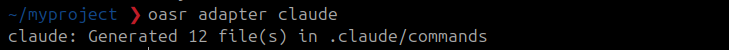 |
| **oasr clone** | 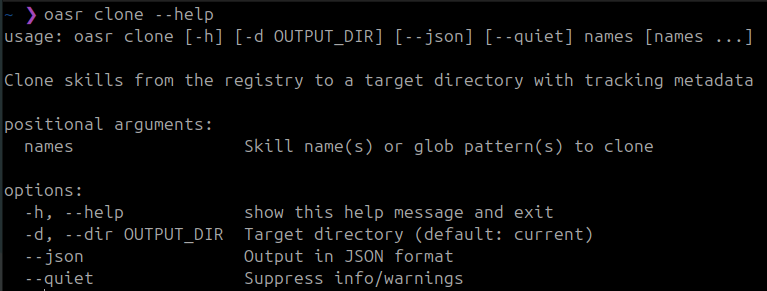 |
| **oasr diff** | 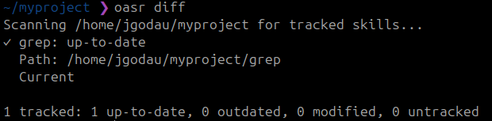 |
| **oasr sync** | 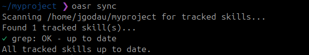 |
| **oasr exec** | 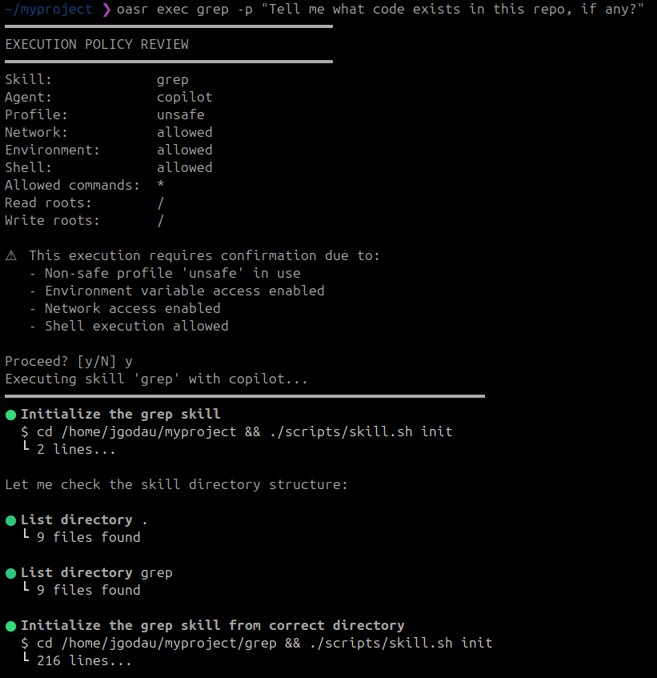 |
| **oasr profile** | 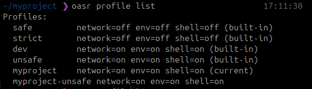 |
| **oasr completion** | 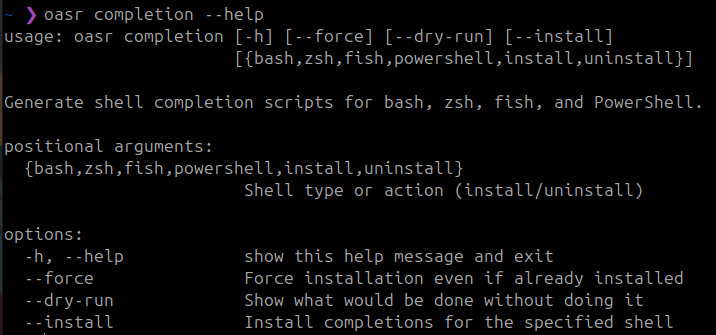 |
| **oasr config** | 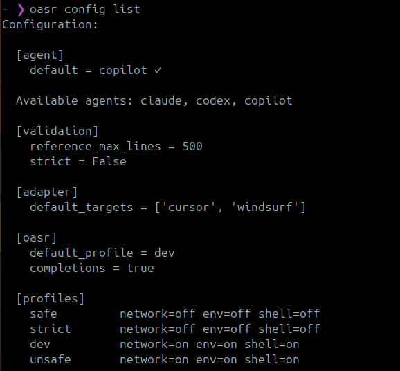 |
| **oasr validate** | 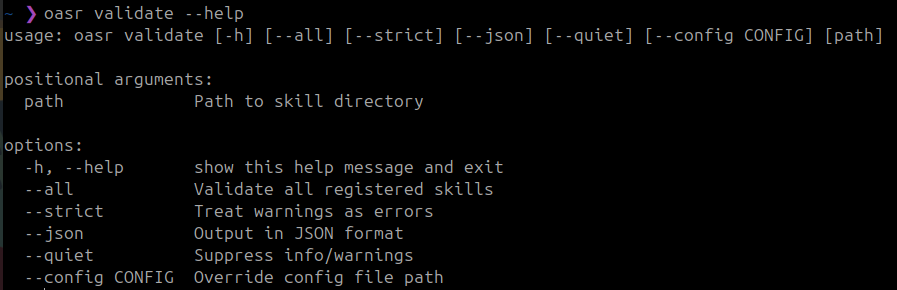 |

See [docs/.images/](docs/.images/) for all screenshots.
