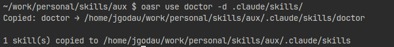
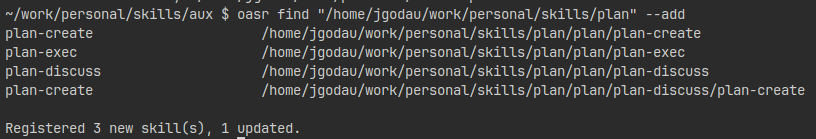
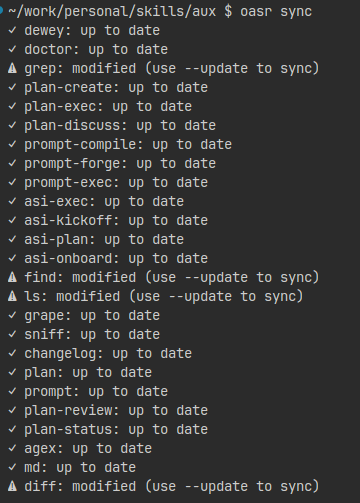

# Command Reference


*Full command help and available commands*


---

## `oasr list`


List all registered skills.

```bash
oasr list              # Human-readable output
oasr list --json       # JSON output
oasr list --verbose    # Show full paths
```

---

## `oasr add`

*Adding local skills*


*Adding remote skills from GitHub*


Register skills in the registry.

```bash
oasr add /path/to/skill
oasr add https://github.com/user/repo/tree/main/skills/my-skill  # Remote URL
oasr add /path/to/skills/*          # Glob paths
oasr add /path/to/skill --strict    # Fail on validation warnings
oasr add -r /path/to/root           # Recursive discovery
```

**Remote Skills:**
- Supports GitHub and GitLab URLs
- Formats: `https://github.com/{user}/{repo}/tree/{branch}/{path}`
- Set `GITHUB_TOKEN` or `GITLAB_TOKEN` for authentication
- Files validated during registration, fetched on-demand during use

---

## `oasr rm`

*Removing skills*


*Removing multiple skills*


Remove skills from the registry.

```bash
oasr rm skill-name
oasr rm /path/to/skill
oasr rm skill-one skill-two         # Multiple
oasr rm "prefix-*"                  # Glob by name
oasr rm -r /path/to/root            # Recursive removal
```

---

## `oasr use`

*Using skills*


Copy skills to a target directory. Supports glob patterns. Works with both local and remote skills.

```bash
oasr use skill-name
oasr use skill-name -d /path/to/project
oasr use "git-*"                    # Glob pattern
oasr use skill-one skill-two        # Multiple skills
```

**Note:** Remote skills are automatically fetched during copy.

---

## `oasr find`

*Finding skills*


*Finding and adding skills*


Discover skills by searching for `SKILL.md` manifests.

```bash
oasr find /path/to/search
oasr find /path/to/search --add     # Register found skills
oasr find /path/to/search --json
```

---

## `oasr validate`

Validate skill structure and `SKILL.md` frontmatter.

```bash
oasr validate /path/to/skill
oasr validate --all                 # All registered skills
oasr validate --all --strict        # Treat warnings as errors
```

See [VALIDATION.md](VALIDATION.md) for validation error and warning codes.

---

## `oasr sync`

*Syncing manifests (dry-run)*


*Syncing manifests (update)*


Synchronize manifests with registered skills.

```bash
oasr sync              # Create manifests where missing
oasr sync --update     # Update manifests for modified skills
oasr sync --prune      # Remove entries for missing source paths
```

---

## `oasr status`

*Showing status*


Show the current state of registered skills.

```bash
oasr status
oasr status --json
```

States: `valid`, `modified`, `missing`, `untracked`

---

## `oasr clean`

Remove orphaned manifests and entries for missing skills.

```bash
oasr clean
oasr clean --dry-run
```

---

## `oasr adapter`

*Generating adapters*


Generate IDE-specific adapter files that delegate to your canonical skills.

```bash
oasr adapter                              # All default targets
oasr adapter cursor                       # Cursor only
oasr adapter windsurf                     # Windsurf only
oasr adapter codex                        # Codex only
oasr adapter copilot                      # GitHub Copilot
oasr adapter claude                       # Claude Code
oasr adapter --exclude skill1,skill2
oasr adapter --output-dir /path/to/project
```

> **NOTE**
> *Skills are **always copied** locally (as of `v2`). The `--copy` flag is deprecated but kept for backward compatibility.*

**Behavior:**

- Skills are automatically copied to `.{ide}/skills/` directories
- Adapter files use relative paths to copied skills
- Remote skills are fetched during generation

**Output Structure:**

```text
.windsurf/
├── skills/my-skill/             ← copied from source (local or remote)
└── workflows/my-skill.md        → points to ../skills/my-skill/
```

### Adapter Outputs

| Target   | Output Path                      |
|----------|----------------------------------|
| cursor   | `.cursor/commands/{skill}.md`    |
| windsurf | `.windsurf/workflows/{skill}.md` |
| codex    | `.codex/skills/{skill}.md`       |
| copilot  | `.github/prompts/*.prompt.md`    |
| claude   | `.claude/commands/{skill}.md`    |

---

## `oasr help`

*Showing help*


Show help for any command.

```bash
oasr help
oasr help list
oasr help adapter
```

---

## Configuration

Stored in `~/.skills/config.toml`:

```toml
[validation]
reference_max_lines = 500
strict = false

[adapter]
default_targets = ["cursor", "windsurf"]
```

---

## `oasr update`

Update `oasr` tool itself from GitHub.

```bash
oasr update                      # Pull updates and reinstall
oasr update --no-reinstall       # Pull only, skip reinstallation
oasr update --changelog 5        # Show 5 changelog entries (default: 10)
oasr update --json               # Output in JSON format
oasr update --quiet              # Suppress info messages
```

**Requirements:**\

- `oasr` must be retain it's cloned repository structure and git history
- Working tree must be clean (no uncommitted changes)
- Remote must be configured (typically GitHub)

> **NOTE**
> PyPI installations are not available yet, but will be coming soon.
> Current `oasr update` command only works with git installations.

**Behavior:**

- Finds `oasr` installation directory
- Runs `git pull --ff-only` from remote
- Displays truncated changelog with commit count
- Reinstalls package with `uv pip install -e .` or falls back to `pip`
- Suppresses verbose git output

**JSON Output:**

```json
{
  "success": true,
  "updated": true,
  "repo_path": "/path/to/asr",
  "remote_url": "https://github.com/user/asr.git",
  "old_commit": "abc1234",
  "new_commit": "def5678",
  "commits": 3,
  "files_changed": 5,
  "insertions": 150,
  "deletions": 42,
  "changelog": [
    "def5678 feat: add new feature",
    "cba4321 fix: resolve bug"
  ]
}
```

---

## Data Locations

| Path                      | Purpose                        |
|---------------------------|--------------------------------|
| `~/.skills/registry.toml` | Registered skills              |
| `~/.skills/manifests/`    | Per-skill manifest snapshots   |
| `~/.skills/config.toml`   | Configuration                  |
