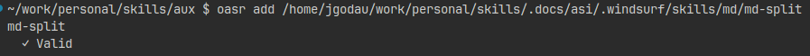
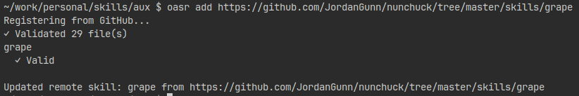

# `oasr add`

Register skills in the registry.

```bash
oasr add /path/to/skill
oasr add https://github.com/user/repo/tree/main/skills/my-skill  # Remote URL
oasr add /path/to/skills/*          # Glob paths
oasr add /path/to/skill --strict    # Fail on validation warnings
oasr add -r /path/to/root           # Recursive discovery
```

**Remote Skills:**

- Supports GitHub and GitLab URLs
- Formats: `https://github.com/{user}/{repo}/tree/{branch}/{path}`
- Set `GITHUB_TOKEN` or `GITLAB_TOKEN` for authentication
- Files validated during registration, fetched on-demand during use

*Adding local skills*


*Adding remote skills from GitHub*

