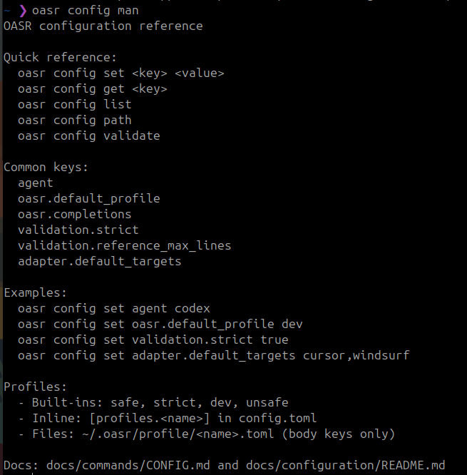

# `oasr config`

Manage OASR configuration settings.

> **Note:** For comprehensive configuration documentation, see [`docs/configuration/`](../configuration/README.md)

## Quick Reference

```bash
oasr config set <key> <value>   # Set a config value
oasr config get <key>            # Get a config value
oasr config list                 # Show all configuration
oasr config agent                # Show agent configuration
oasr config validation           # Show validation settings
oasr config adapter              # Show adapter settings
oasr config oasr                 # Show core OASR settings
oasr config profiles             # Show available profiles
oasr config man                  # Show config reference
oasr config validate             # Validate config file
oasr config path                 # Show config file location
```

**See also:**
- [Configuration Overview](../configuration/README.md) - Complete config guide
- [Environment Variables](../configuration/environment-variables.md) - OASR_* reference
- [Agent Configuration](../configuration/agent.md) - Agent settings
- [Policy Profiles](../configuration/profiles.md) - Execution policies

---

## Usage

```bash
oasr config set <key> <value>    # Set a config value
oasr config get <key>             # Get a config value
oasr config list                  # Show all configuration
oasr config agent                 # Show agent configuration
oasr config validation            # Show validation settings
oasr config adapter               # Show adapter settings
oasr config oasr                  # Show core OASR settings
oasr config profiles              # Show available profiles
oasr config man                   # Show config reference
oasr config validate              # Validate config file
oasr config path                  # Show config file location
```

## Subcommands

### `config set`

Set configuration values:

```bash
oasr config set agent codex         # Set default agent
oasr config set agent copilot
oasr config set agent claude
oasr config set agent opencode
```

**Agent Validation**: Only supported agents can be set. The command validates against available agent drivers.

### `config get`

Retrieve configuration values:

```bash
oasr config get agent               # Get default agent
oasr config get validation.strict   # Get validation strictness
```

Returns the value or indicates if not set:
```
codex
```

### `config agent`

Show default agent and availability:

```bash
oasr config agent
```

### `config validation`

Show validation configuration:

```bash
oasr config validation
```

### `config adapter`

Show adapter configuration:

```bash
oasr config adapter
```

### `config oasr`

Show core OASR settings:

```bash
oasr config oasr
```

### `config profiles`

Show available profiles (built-in + custom + profile files):

```bash
oasr config profiles
oasr config profiles --names
```

### `config man`

Show a concise configuration reference:



```bash
oasr config man
```

### `config validate`

Validate your config file (creates default if missing):

```bash
oasr config validate
```

### `config path`

Show the location of the configuration file:

```bash
oasr config path
```

### `config list`

Display all configuration with formatted output:


```bash
oasr config list
```

**Example output:**
```
Configuration:

  [agent]
    default = codex ✓

  Available agents: codex, copilot

  [validation]
    reference_max_lines = 500
    strict = false

  [adapter]
    default_targets = cursor, windsurf

  [oasr]
    default_profile = safe
    completions = true

  [profiles]
    safe         network=off env=off shell=off
    strict       network=off env=off shell=off
    dev          network=on env=on shell=on
    unsafe       network=on env=on shell=on
```

**Agent Availability Indicators:**
- ✓ — Agent CLI binary found in PATH
- ✗ — Agent CLI binary not installed

## Configuration Structure

The config file uses TOML format:

```toml
[agent]
default = "codex"

[validation]
reference_max_lines = 500
strict = false

[adapter]
default_targets = ["cursor", "windsurf"]

[oasr]
default_profile = "safe"
completions = true

[profiles.safe]
# built-in safe profile (override if desired)
```

## Agent Configuration

### Setting a Default Agent

Configure which agent `oasr exec` uses by default:

```bash
oasr config set agent codex
```

This allows you to run skills without specifying `--agent` each time:

```bash
# Uses configured default agent
oasr exec my-skill -p "Do something"
```

### Supported Agents

| Agent | CLI Binary | Command Format |
|-------|-----------|----------------|
| **Codex** | `codex` | `codex exec "<prompt>"` |
| **Copilot** | `copilot` | `copilot -p "<prompt>"` |
| **Claude** | `claude` | `claude <prompt> -p` |
| **OpenCode** | `opencode` | `opencode run "<prompt>"` |

### Checking Agent Availability

Use `oasr config list` to see which agents are installed and available:

```bash
oasr config list
```

Look for the **Available Agents** section with ✓/✗ indicators.

## Examples

### Initial Setup

Configure your preferred agent after installation:

```bash
# Set default agent
oasr config set agent codex

# Verify configuration
oasr config get agent
# Output: codex

# See full config
oasr config list
```

### Switching Agents

Change your default agent at any time:

```bash
# Switch to Copilot
oasr config set agent copilot

# Verify change
oasr config get agent
# Output: copilot
```

### Troubleshooting

Find your config file location:

```bash
oasr config path
```

Check which agents are available:

```bash
oasr config list | grep -A 5 "Available Agents"
```

## Related Commands

- [`oasr exec`](EXEC.md) — Execute skills using configured agent
- [`oasr registry`](REGISTRY.md) — Manage skill registry

## Configuration File Location

Default: `~/.oasr/config.toml`

Override with `--config` flag:
```bash
oasr --config /custom/path/config.toml config list
```

## Error Handling

### Agent Not Available

If you try to set an unavailable agent:

```bash
oasr config set agent unknown-agent
```

Output:
```
Error: Invalid agent 'unknown-agent'
Valid agents: codex, copilot, claude, opencode
```

### Agent Binary Not Found

If the configured agent binary is not in your PATH:

```bash
oasr exec my-skill -p "test"
```

Output:
```
Error: Agent 'codex' is not available

Available agents:
  ✗ codex
  ✓ copilot
  ✗ claude
  ✗ opencode

Configure a different agent:
  oasr config set agent copilot
```

### Config Validation

```bash
oasr config validate
```

## Execution Policy Profiles (v0.5.0+)

Policy profiles define security boundaries for `oasr exec`. They control what agents can do during skill execution.

### Default Profile

Set the default execution policy profile:

```bash
oasr config set oasr.default_profile safe
oasr profile dev
```

This determines which profile is used unless overridden with `--profile`.

### Default Editor

Set the default editor for profile editing:

```bash
oasr config set oasr.editor "code --wait"
oasr config set oasr.editor vim
```

Priority: `oasr.editor` > `$EDITOR` > `$VISUAL` > system default (vi/notepad).

### Defining Custom Profiles

Add custom profiles to `~/.oasr/config.toml`:

```toml
[oasr]
default_profile = "safe"

# Conservative default
[profiles.safe]
fs_read_roots = ["./"]
fs_write_roots = ["./out", "./.oasr"]
deny_paths = ["~/.ssh", "~/.aws", "~/.gnupg", ".env"]
allowed_commands = ["rg", "fd", "jq", "cat"]
deny_shell = true
network = false
allow_env = false

# Development profile (more permissive)
[profiles.dev]
fs_read_roots = ["./", "~/projects"]
fs_write_roots = ["./", "~/projects/output"]
deny_paths = ["~/.ssh", "~/.aws"]
allowed_commands = ["bash", "curl", "git", "python"]
deny_shell = false
network = true
allow_env = true
```

### Profile Settings Reference

| Setting | Type | Description |
|---------|------|-------------|
| `fs_read_roots` | list[string] | Allowed filesystem read locations |
| `fs_write_roots` | list[string] | Allowed filesystem write locations |
| `deny_paths` | list[string] | Explicitly denied paths (glob patterns supported) |
| `allowed_commands` | list[string] | Permitted shell commands |
| `deny_shell` | bool | Deny all shell execution |
| `network` | bool | Allow network access (enabled/disabled) |
| `allow_env` | bool | Allow environment variable access |

See [`oasr exec` documentation](EXEC.md#security-model) for detailed security model explanation.

### Profile Files

Place profile files under `~/.oasr/profile/<name>.toml` (body keys only). Inline profiles override files with the same name.

## Advanced Usage

### Direct Config File Editing

The config file is plain TOML and can be edited directly:

```bash
# Open in editor
$EDITOR ~/.oasr/config.toml
```

**Warning**: Manual edits bypass validation. Use `oasr config set` when possible.

### Config Validation

OASR validates configuration on load:
- Agent names must be in supported list
- Numeric values must be positive integers
- Boolean values must be true/false

Invalid configs are rejected with helpful error messages.
