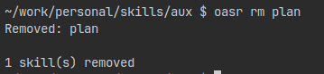
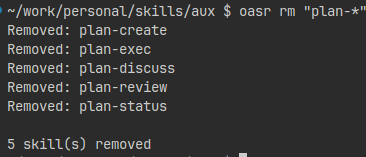

# `oasr rm`

Remove skills from the registry.

```bash
oasr rm skill-name
oasr rm /path/to/skill
oasr rm skill-one skill-two         # Multiple
oasr rm "prefix-*"                  # Glob by name
oasr rm -r /path/to/root            # Recursive removal
```

*Removing skills*


*Removing multiple skills*
