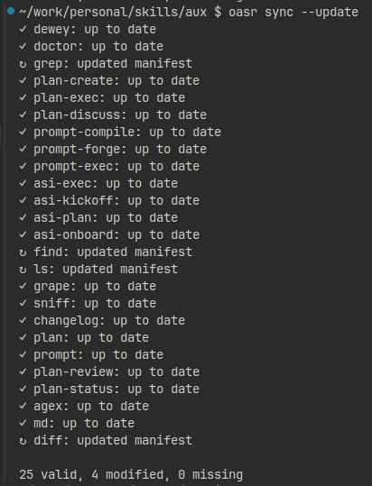

# `oasr sync`

Synchronize manifests with registered skills.

```bash
oasr sync              # Create manifests where missing
oasr sync --update     # Update manifests for modified skills
oasr sync --prune      # Remove entries for missing source paths
```

> **note**  
> `oasr sync` executes a check (dry-run) by default, showing what would be done without making changes. Use `--update` to apply changes.

> **note**  
> `--prune` behaviour can also be accomplished through `oasr clean`

*Syncing manifests (dry-run)*


*Syncing manifests (update)*

